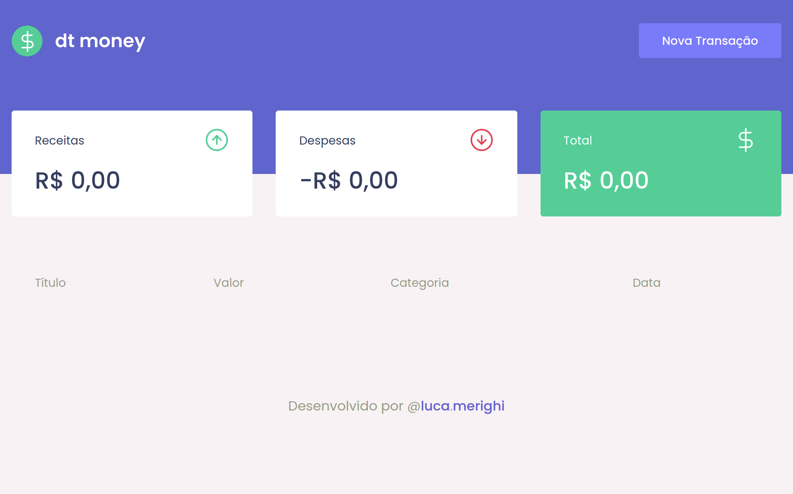

# Ignite ReactJS - dtmoney
Projeto da trilha **Ignite ReactJS** onde colocamos em prática conceitos básicos da biblioteca como componentes, estados, propriedades, hooks e integração do React com o **TypeScript**.  
É uma aplicação para gerenciar sua situação financeira com receitas, despesas e total.

  
